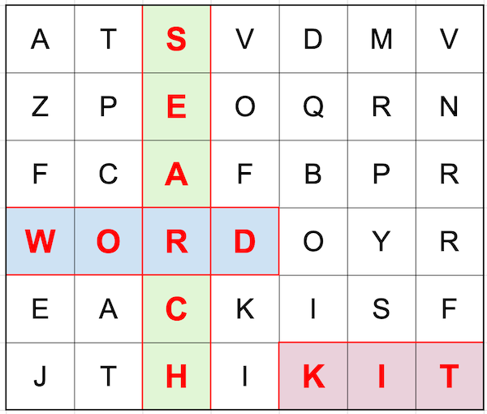

# WordSearchKit

### About

This is a library for generating word searches. This has been created in my down time (aka unemployment) for bit of fun and to prevent myself from growing rusty.

As it's been created over a few hours, it's not super optimised and could easily be improved upon, I'm sure.

Also, yes - I did generate that cheesy logo in Google Sheets. 

### Installation

Adding this to your project is simply a case of adding `https://github.com/mylogon341/WordSearchKit.git` to Xcode Package manager.

### Demo project

To see the library being used in a sample project, check out another repo [here](https://github.com/mylogon341/WordSearchKit-Demo).

### Usage

```swift
import WordSearchKit

// Generate grid
let grid = try WordSearchKit.generate(
  .init(
    rows: 10, 
    columns: 10, 
    words: ["meh", "blah", "example"])
)

// access answers
let words = grid.placedWords

// check the start and stop grid position
if let found = WordSearchKit.checkPoints(
                                grid: wordSearchGrid,
                                start: start, 
                                end: end) {
  print("found word: \(found)")
} else {
  print("no word found")
}
```

### Contribution
If you spot a way this can be optimised or improved upon, feel free to open a PR.